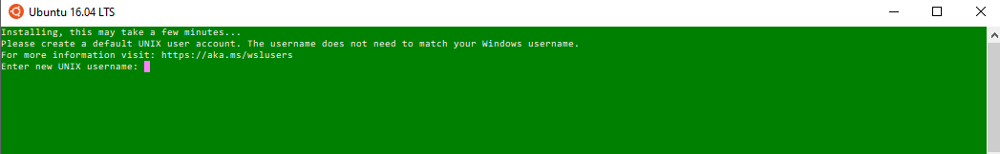

##Set up your distro

The first time you launch a newly installed Linux distro, a console window will open and you'll be asked to wait for a minute or two for files to de-compress and be stored on your PC. All future launches should take less than a second.

After installing a Linux distro from the Microsoft Store, the first step you will be asked to complete when opening your newly installed Linux distro is to create an account, including a User Name and Password.

- This User Name and Password is specific to your Linux distribution and has no bearing on your Windows user name.

- Once you create this User Name and Password, the account will be your default user for the distro and automatically sign-in on launch.

- This account will be considered the Linux administrator, with the ability to run sudo (Super User Do) administrative commands.

- Each Linux distro running on the Windows Subsystem for Linux has its own Linux user accounts and passwords. You will have to configure a Linux user account every time you add a distro, reinstall, or reset.

More information on [User Support](https://docs.microsoft.com/en-us/windows/wsl/user-support)