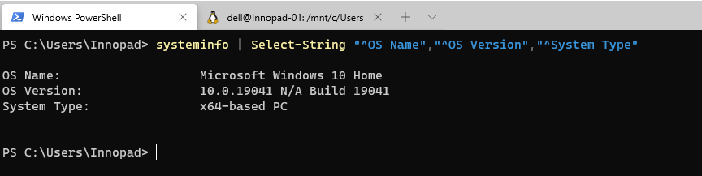

#Requirements

For the *EESSI WSL Client* you need to run Windows 10, so check if you are running Windows 10 - (64 bit version), if not update to version 2004, Build 19041 or higher.

###Check your version of Windows 10

*Open PowerShell as Administrator and run:*
~~~
  systeminfo | Select-String "^OS Name","^OS Version","^System Type"
~~~

###Install the Windows Subsystem for Linux

Before installing any Linux distributions on Windows, you must enable the ***"Windows Subsystem for Linux"*** optional feature.

*Open PowerShell as Administrator and run:*
~~~
  dism.exe /online /enable-feature /featurename:Microsoft-Windows-Subsystem-Linux /all /norestart
~~~

This will install WSL 1, **we need WSL 2**. Upgrade to WSL 2 - and don't restart your Windows 10 now!

#### Enable the 'Virtual Machine Platform' optional component
Before we upgrading to WSL 2, you must enable the "Virtual Machine Platform" optional feature.

*Open PowerShell as Administrator and run:*
~~~
dism.exe /online /enable-feature /featurename:VirtualMachinePlatform /all /norestart
~~~

#### Set WSL 2 as your default version
Run the following command in PowerShell to set WSL 2 as the default version when installing a new Linux distribution:

 *Open PowerShell as Administrator and run:*
~~~
wsl --set-default-version 2
~~~

!!! Note
    You might see this message after running that command: ***WSL 2 requires an update to its kernel component. For information please visit https://aka.ms/wsl2kernel***. Please follow the link [https://aka.ms/wsl2kernel](https://aka.ms/wsl2kernel) and install the MSI from that page on our documentation to install a Linux kernel on your machine for WSL 2 to use. Once you have the kernel installed, please run the command again and it should complete successfully without showing the message.