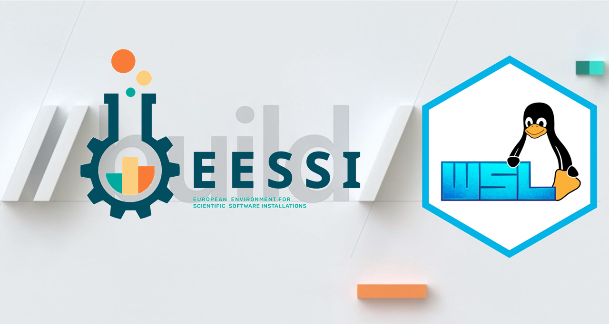

###  European Environment for Scientific Software Installations

The European Environment for Scientific Software Installations is based on the CernVM File System (CernVM-FS). It's a read-only file system designed to deliver scientific software onto virtual machines and physical worker nodes in a fast, scalable, and reliable way

## Scope & Goals
Through the EESSI project, we want to set up a shared stack of scientific software installations, and by doing so avoid a lot of duplicate work across HPC sites.

For end users, we want to provide a uniform user experience with respect to available scientific software, regardless of which system they use.

